# Configuring the Gateway
Assuming you have successfully logged into your LoRaWAN™ Gateway using SSH. Enter the following command in the command line:

```
sudo gateway-config
```

You will now then see a page like the following picture below


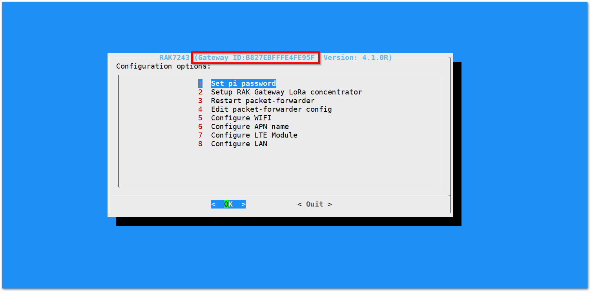
1. **Set pi password** - used to set/change the password of the LoRaWAN™ Gateway.
2. **Set up RAK Gateway LoRa Concentrator** - used to configure the frequency, which the LoRaWAN™ Gateway will operate on, and the LoRaWAN™ Server which the LoRaWAN™ Gateway will work with.
3. **Restart packet -forwarder** - used to restart the LoRa® packet forwarded process.
4. **Edit packet-forwarder config** - used to open the global_conf.json file, in order to edit LoRaWAN™ parameters manually.
5. **Configure Wifi** - used to configure the Wi-Fi settings in order to connect to a network.
6. **Configure APN Name** - used to configure the APN name of pppd.
7. **Configure LTE Module** - (Online for the Cellular Version) - used to configure automatic LTE network connection on startup.
8. **Configure LAN** - used to configure the Ethernet adapter settings.

>**Note:** A unique ID will be generated in for LoRaWAN™ Gateway. This is also called Gateway EUI squared in red in the figure above and is essential for registering the gateway with any LoRa® Network Server (TTN, ChirpStack)

There is also another way to get your "Gateway ID", just enter the command below in the command line:

```
sudo gateway-version
```


## Setting a new password for the Gateway
It is a good security practice to change the default password **"raspberry"** which is the same on all Raspberry Pi devices.

1. First, choose "**1 Set pi password**" option referred on the image below.
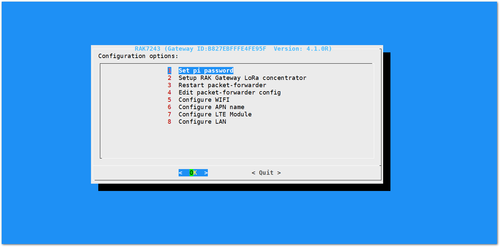

2. Next, press "Yes" and you will be asked to enter your new password twice then press "Enter".


3. Alright, the success message for changing password will then pop up.
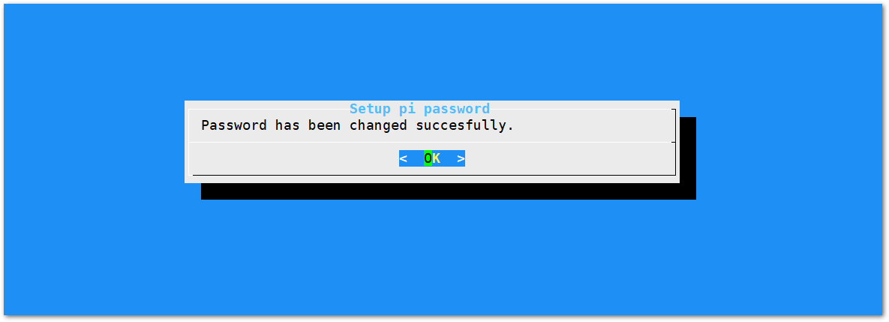

## Set up RAK Gateway LoRa Concentrator
This menu allows you to select your LoRa® frequency band and one of the two available Networks Server options by choosing "**2 Setup RAK Gateway LoRa concentrator**"

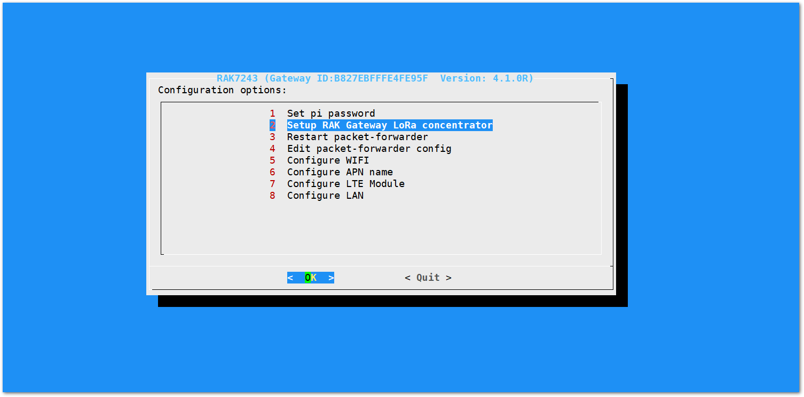

You can choose one of two supported LoRa Servers here: TTN or ChirpStack.

### Server is TTN

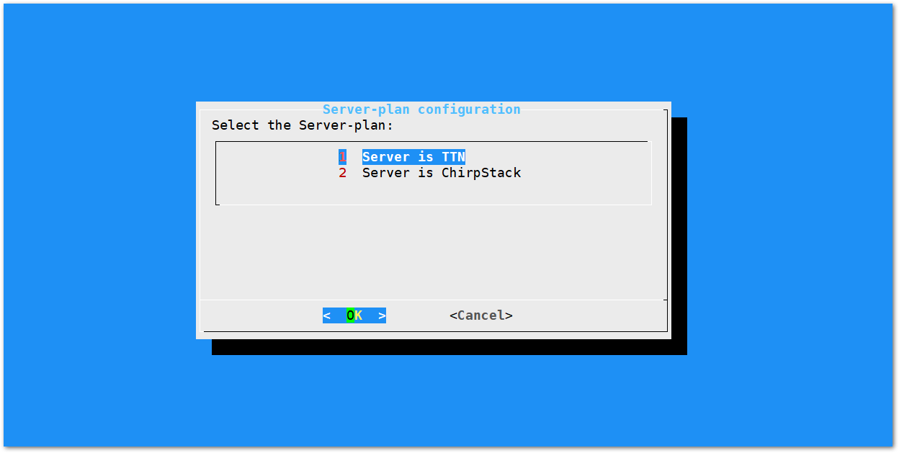

* **TTN (The Things Network).** If you choose TTN as the LoRa® Server, you will see the following page. Visit this [article](https://www.thethingsnetwork.org/docs/lorawan/frequencies-by-country.html) for more information on your local TTN frequency plan. This will allow you to choose the correct plan.

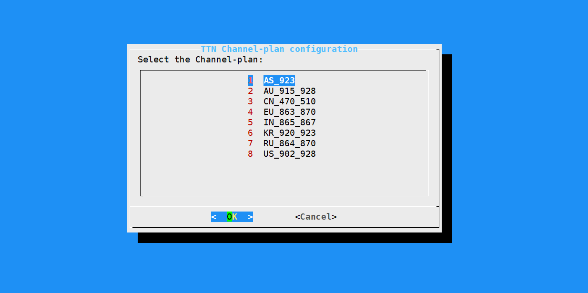

After choosing the correct frequency, the success message will appear as shown below.


### Server is Chirpstack
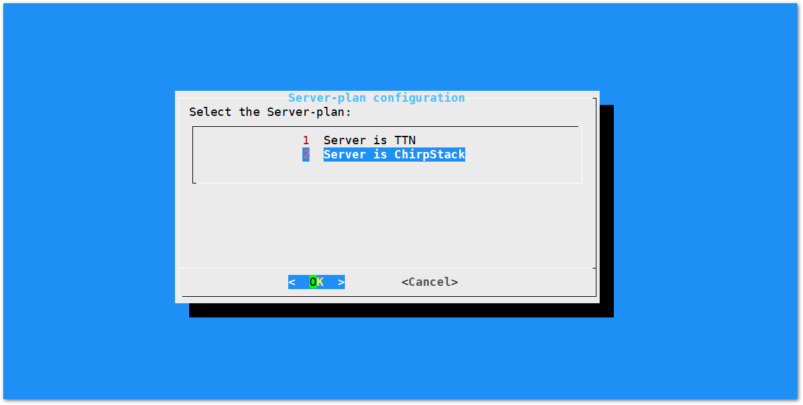

**ChirpStack** - If you choose Chirpstack as your LoRa® Server, you will see the following page with two options available:

* **ChirpStack Channel Plan Configuration** - used to configure your Regional Frequency Band.
* **ChirpStack ADR Configure** - used to enable/disable the Adaptive Data Rate (ADR) functionality.

First, select option 1 for configuring your Regional Frequency Band

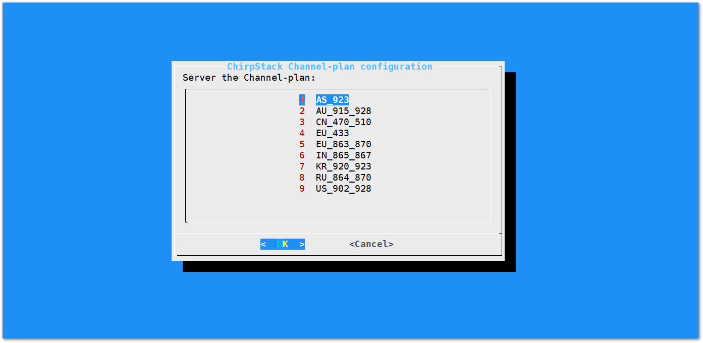

Then, set the IP address of the ChirpStack which you want your LoRaWAN™ Gateway to work with:

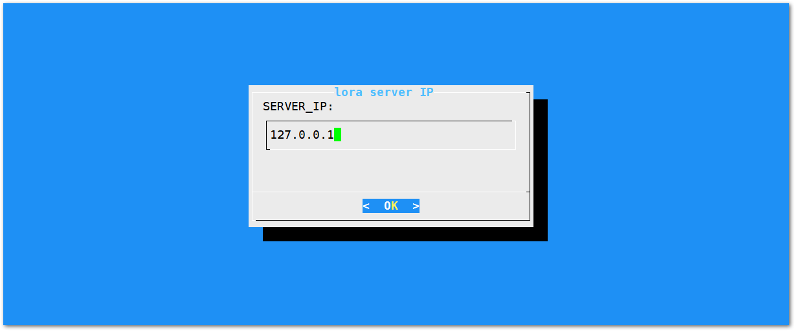

>**Note**: The default IP Address is `127.0.0.1` which means you will be using the Built-in LoRa® Server. If you want to use an independent LoRa® Server running on another device or a cloud based LoRa® Server, you need to set it to the corresponding IP address


* If you have instead selected "Chirpstack ADR Configure" you can enable/disable the Adaptive Data Rate (ADR) functionality:

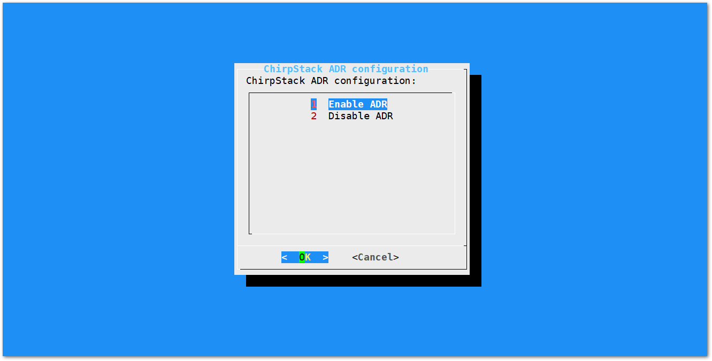

## Connect the LoRaWAN™ Gateway to a Router

If you want to use TTN or an independent LoRaServer which may be deployed in Local area network or Internet, you need to connect your LoRaWAN™ Gateway to a router first.

### Connect through Wi-Fi
If you want to connect through Wi-Fi, it can easily be done with the Wireless capabilities of the Raspberry Pi 3B+. By default, the RAK7243C LoRaWAN™ Developer Gateway works in Wi-Fi AP Mode. In order for the Gateway to connect to the router, it must work in Wi-Fi Client Mode.


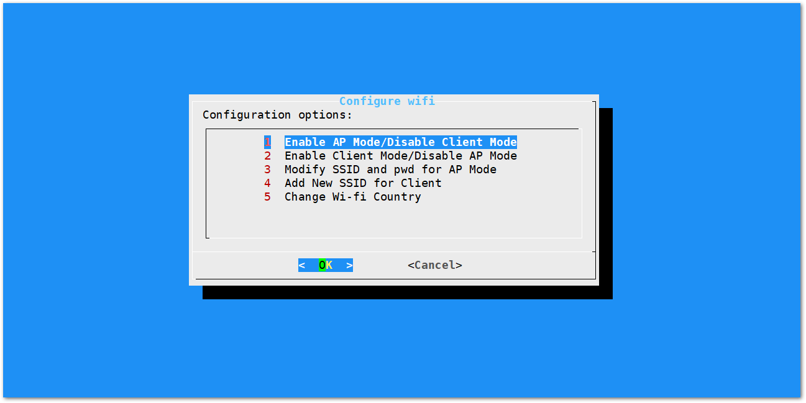

There are 5 options to choose from in the Wi-Fi configuration menu:

1. **Enable AP Mode/Disable Client Mode** - the LoRaWAN™ Gateway will work in Wi-Fi Access Point Mode after rebooting while the Wi-Fi Client Mode will be disabled (this is the default mode).
2. **Enable Client Mode/Disable AP Mode** - the LoRaWAN™ Gateway will work in Wi-Fi Client mode after rebooting, while Wi-FI AP Mode will be disabled.
3. **Modify SSID and pwd for AP Mode** - used to modify the SSID and password of the Wi-Fi AP. Only works if the Wi-Fi AP Mode is enabled.
4. **Add New SSID for Client** - this is used if you want to connect to a new Wi-Fi Network. Only works in Wi-Fi Client mode.
5. **Change Wi-Fi Country** - this is used to modify the Resident Country to match with Wi-Fi standards.

> **Note**: In order to enable Wi-Fi client mode, you need to disable first the AP Mode.

Once Wi-Fi AP Mode has been disabled by choosing Item 2, you can now then connect to a new Wi-Fi Network by choosing Item 4:

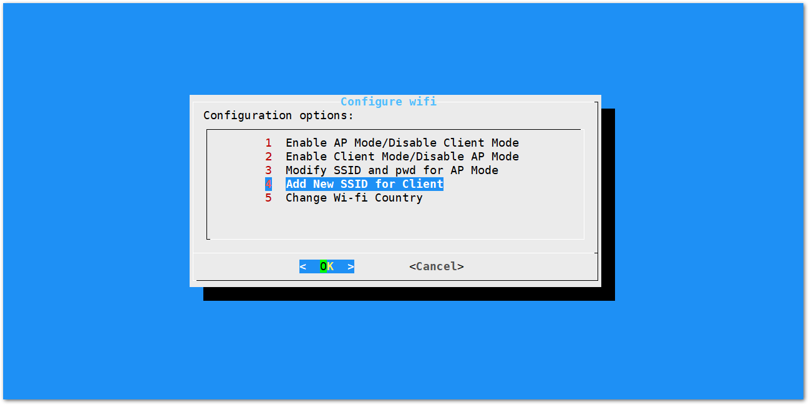

* Start by Selecting your Country of residence
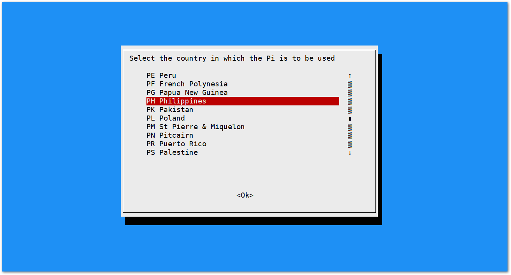

* Enter the SSID of the network you want to connect:
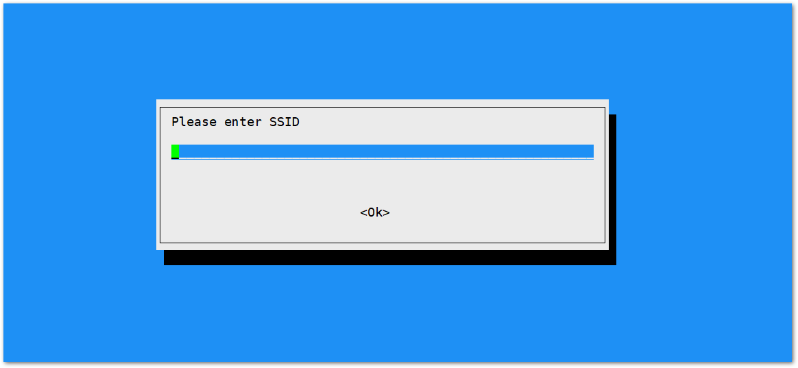

* Enter also the password. Just leave it empty if None.
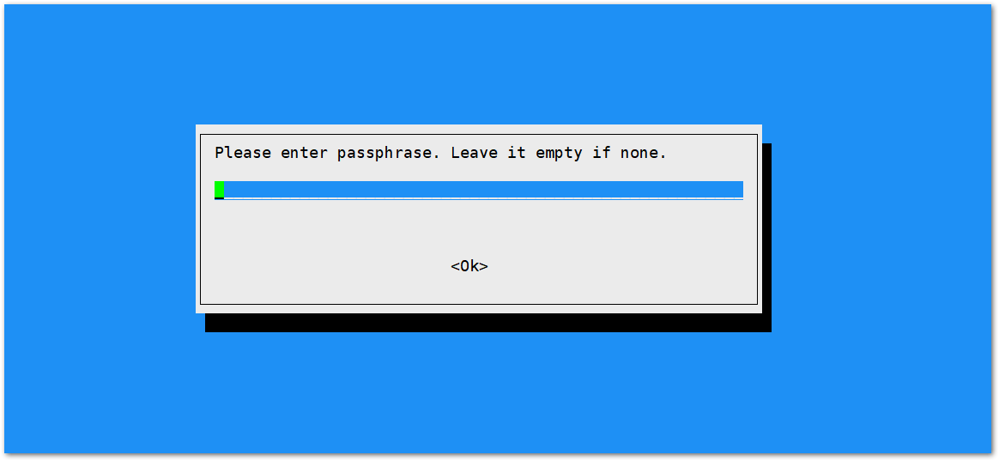

> Please ensure to input the correct Wi-Fi SSID and Password or you will not be able to connect to the gateway again via SSH in Wi-Fi AP Mode. If stuck in this situation, please follow this procedure listed in the FAQs document applicable for all Raspberry Pi based gateways to work again in Wi-Fi AP mode.

### Connect through Ethernet
If you want to connect to router through Ethernet Cable, do the following steps:

* In the main configuration menu, choose “6 Configure LAN”. This will let you set up a static IP address for the Gateway’s Ethernet adapter.
* Just fill a static IP Address according to the IP address of the router you want to connect. Please note that the LoRaWAN™ gateway and the router must be in the same network segment, otherwise the connection will fail.
* By default, the IP Address of the LoRaWAN™ Gateway's Ethernet is `192.168.10.10`
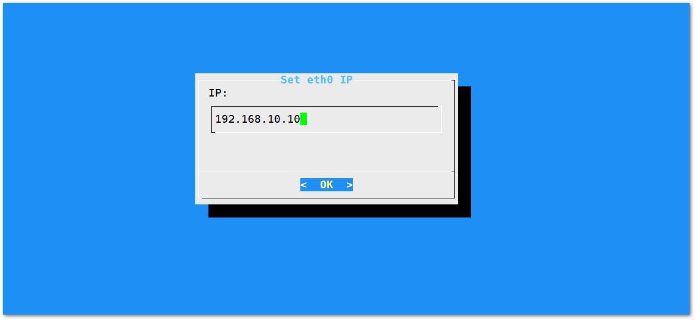

* Then configure the IP address of the Router. This is the LAN Interface IP address of the router:
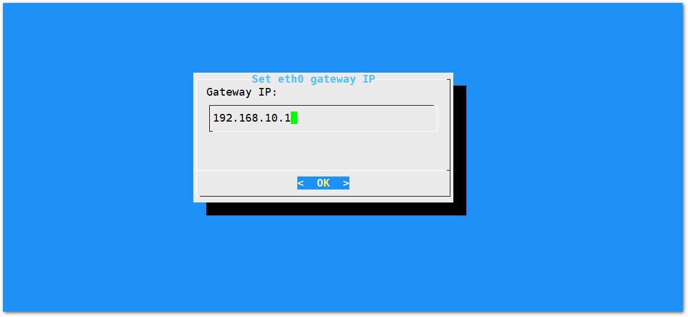

* Press OK then the success message will appear.
* Lastly, reboot the LoRaWAN™ Gateway using the command `sudo reboot` in the command line and it will connect to the router successfully through Ethernet.


